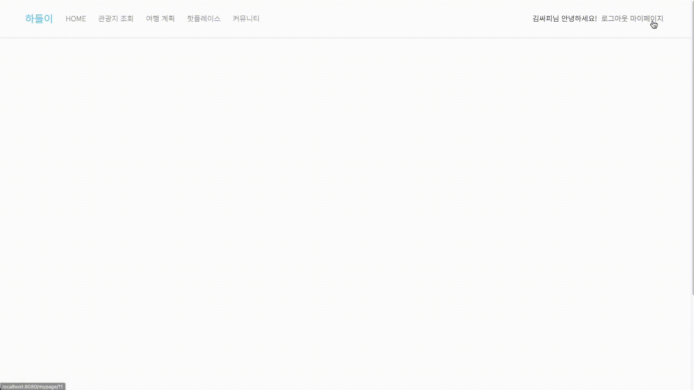
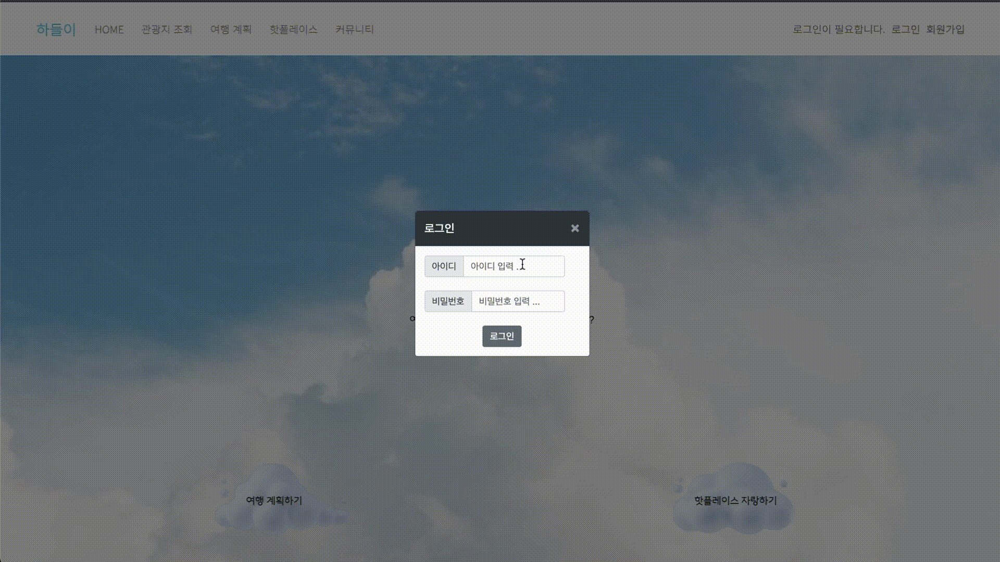
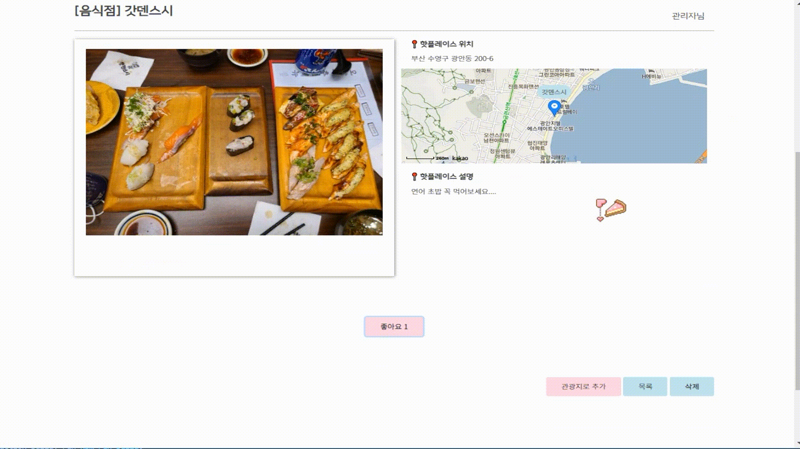

# hadeul-i

## 💡 프로젝트 개요
* 관광지 조회, 여행 계획 설정, 핫플레이스, 커뮤니티 기능을 통해 관광지 정보를 제공하는 서비스

 

## 👥 팀원

<table>
    <tr>
    <td align="center">팀장</td>
    <td align="center">팀원</td>
  </tr>
  <tr>
   <td align="center"><a href="https://github.com/seongho-98"> <b>하성호</b></a> </td>
    <td align="center"><a href="https://github.com/Harinee68"> <b>이하린</b></a> </td>
  </tr>
</table>

 

## ⏱️ 개발 기간
* 2023.05.18(목) ~ 2023.05.25(목)

  

## 🛠️ 사용 기술 
* Design

* Front-End

    
  

* Back-End

   

* API

* Team Collaboration Tool

 

 

## 🐬 데이터베이스 모델링 (ERD) 

  

## 📺 실행 화면

### 1. 메인 페이지

 

### 2. 회원가입 및 로그인
 
*  JWT 토큰으로 로그인 처리
 

### 3. 커뮤니티
 
* 자유롭게 의견 교환이 가능한 익명 커뮤니티 게시판
* 전체 게시물 조회, 게시물 상세 조회, 등록, 수정, 삭제, 댓글 기능
 

### 4. 여행 계획
 
* 여행 계획을 세울 수 있고, 다른 사람들의 계획도 볼 수 있는 게시판
* 카카오 맵  API로 관광지 위치 조회 및 여행 경로 확인
* 전체 여행 계획 조회, 상세 조회, 좋아요 기능
 

### 5. 핫플레이스
 
* 나만 알기 아까운 나만의 핫플레이스를 공유할 수 있는 게시판
* 전체 게시물 조회, 게시물 등록, 상세 조회, 삭제, 검색, 좋아요 기능
 

### 6. 마이페이지
 
* 회원 자신에 대한 활동 및 정보를 볼 수 있는 페이지
* 회원 정보 수정, 삭제, 최근 등록한 게시물 확인 기능
 

### 7. 관광지 조회
 
* <a href="https://www.data.go.kr/tcs/dss/selectApiDataDetailView.do?publicDataPk=15101578">한국관광공사_국문 관광정보 서비스_GW</a> 에서 제공되는 관광지에 대한 정보와 핫플레이스에서 관광지로 선정된 사용자 추천 관광지를 볼 수 있는 페이지
* 전체 관광지 조회, 핫플레이스 관광지 조회, 관광지 상세 조회, 좋아요 기능
 

### 8. 관리자
* 회원 관리
   
  * 관리자로 로그인 시, 회원 관리를 위한 페이지 제공
* 사용자 추천 관광지 등록
    
  * 관리자로 로그인 시, 핫플레이스 게시물을 사용자 추천 관광지에 등록할 수 있는 기능
